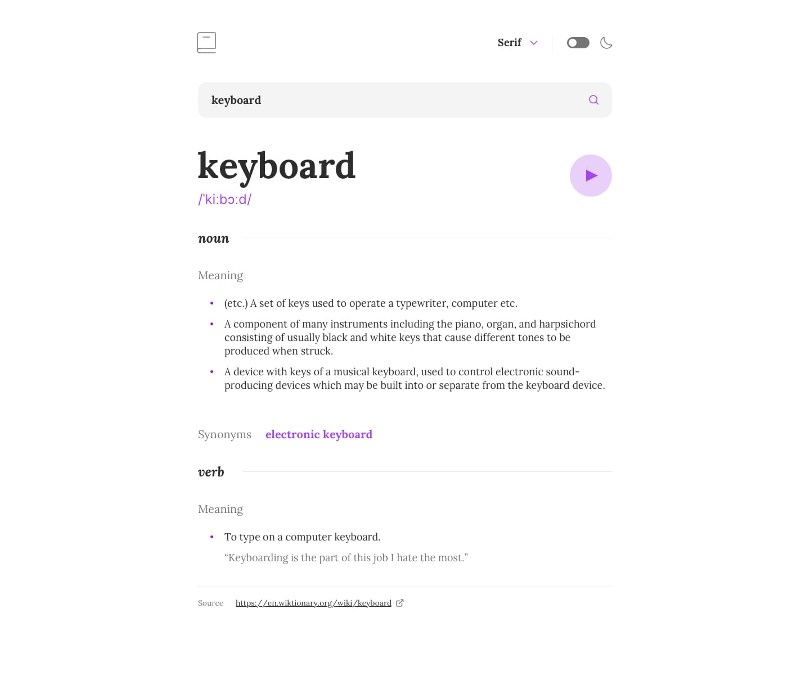

# Dictionary App

El desafío es construir esta aplicación web del diccionario utilizando el Diccionario API y que se vea lo más cerca posible del diseño.

## Diseños

### Diseño Desktop

### Diseño Tablet

### Diseño Mobile

Puede usar cualquier herramienta que desee para ayudarlo a completar el desafío. Entonces, si tienes algo que te gustaría practicar, siéntete libre de intentarlo.

__Sus usuarios deberían poder:__

- [x] Busque palabras usando el campo de entrada
- [x] Vea la respuesta de la API del diccionario gratuito para la palabra buscada
- [x] Reproduzca el archivo de audio por una palabra cuando esté disponible
- [x] Cambiar entre serif, sans serif y fuentes monoespaciales
- [x] Cambiar entre temas claros y oscuros
- [x] Consulte un mensaje de validación de formulario cuando intente enviar un formulario en blanco (con React)
- [x] Pantalla cuando no se encuentra una palabra.
- [x] Pantalla cuando hay un error.
- [x] Vea el diseño óptimo para la interfaz según el tamaño de pantalla de su dispositivo
- [ ] Hacer un enlace para palabras similares
- [ ] Vea los estados de desplazamiento y enfoque para todos los elementos interactivos en la página
- [ ] Bonificación: Elija el esquema de color correcto para ellos en función de sus preferencias informáticas. Sugerencia: Investigación prefers-color-scheme en CSS.

[API del diccionario](https://api.dictionaryapi.dev/api/v2/entries/en/hello)